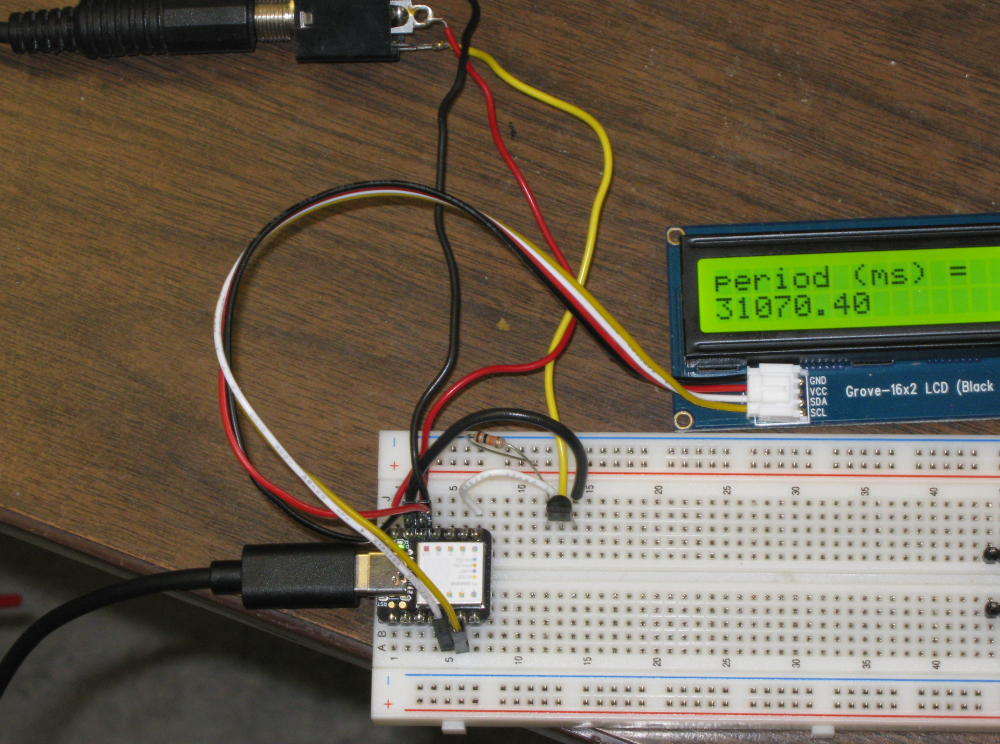
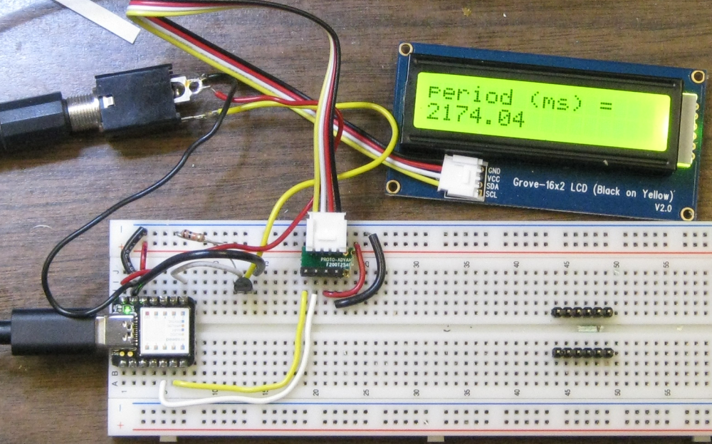
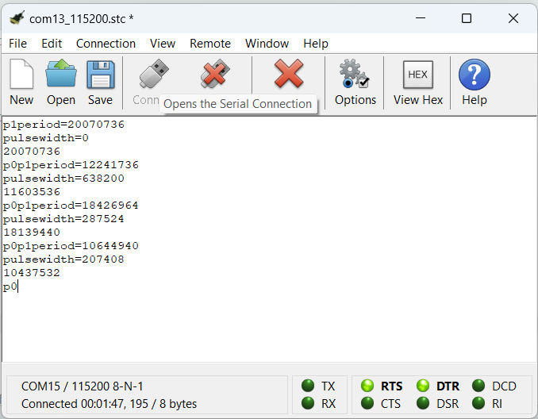

# SAMD21 32bit timer.

This Arduino program enables a 32bit timer on a SAMD21 by combining TC Counters 4 & 5.
The SAMD21 is configured to load the CC0 and CC1 with pulse and period measurements from a single pin.

* Additional original description in the next subsection. 
* This fork intended to introduce changes as follows:
    * Output shall be in milliseconds rather than nanoseconds
	* remove all calculations from interrupt handler function
	* Will use I2C LCD Display rather than serial monitor. Goal is to build a stand alone timer that
	  does not require a computer connection.
* Considering adding keypad to choose mode (pulse, period or pendulum.
* Future modifications might be used to replace https://github.com/danpeirce/photogate-box-ssd1306term 

In this branch 

* a Grove-16x2 (black on Yellow) LCD is used.
* configured for period measurement only.

* Alternate cables

## Circuit

* Seeeduino Xiao microcontroller board
* BS170 MOSFET for level shift and inversion
* 10 Kohm pullup resistor 
* Grove-16x2 (black on Yellow) LCD

Considering adding a 4x3 membrane keypad for configuration selection.

## Testing on the Seeed XIAO

* See https://www.seeedstudio.com/Seeeduino-XIAO-Arduino-Microcontroller-SAMD21-Cortex-M0+-p-4426.html
    * and https://wiki.seeedstudio.com/Seeeduino-XIAO/#software
* Alternate source https://dronebotworkshop.com/seeeduino-xiao-intro/

### Pros and Cons of Seeed XIAO

#### Pros

* More pins than the Trinket M0
* Lower price than Trinket M0 

#### Cons

* No reset button (must short pads)
* USB C connector
    * I have preference for USB microB connector as we have cables and they are less expensive.

### Example Output

Simple test:

## Original Section from Original Repo

This arduino program will enable a 32bit timer on a SAMD21 by combining TC Counters 4 & 5.
The SAMD21 is configured to load the CC0 and CC1 with pulse and period measurements from a single pin.
My purpose for creating this was to trim oscillators and measure longer durations.
This arduino file will work on both the Seeeduino XIAO and Adafruit Trinket M0 (tested on both).
Once programmed a serial port needs to be opened to the device before the measurement is made.
An optional delay is included after a single period has been measured (as to not overwhelm the serial port).

I highly recommend the Seeedino Xiao over the Trinket M0 as it is cheaper and has more pins.
I'm not a big fan of the USB C connector on the Xiao (I prefer the Trinket M0's micro USB), as I needed to buy more C type cables.
My Seedino Xiao spends most of the time connected to my Raspberry Pi (as the Pi does not have any real-time measuring capability). 

Why use a 32bit timer instead of a 16bit one? A 32bit timer can measure a period/pulse of 89.5 seconds at maximum precision without overflowing ( 20.8ns * 2 ^ 32 ).
What can a 16bit timer measure (without overflowing, at maximum precision)... 1.36 milliseconds.

There is no license for this work, it is use-at-your-own-risk (I assume no liability).
Many parts of this program came from on-line forums. I included the URLs in the program header to give credit.
